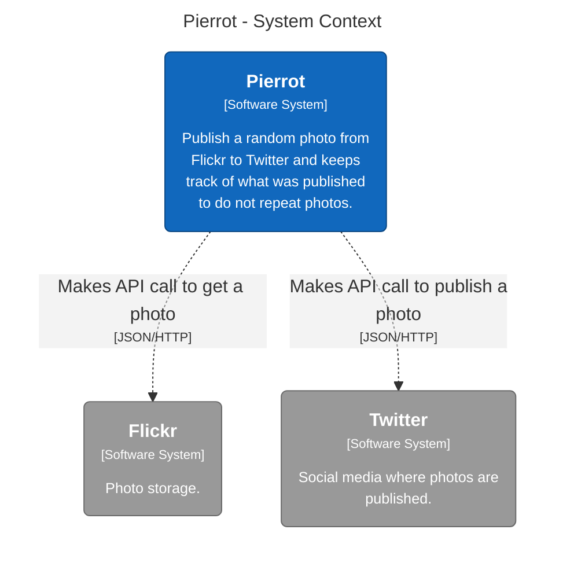
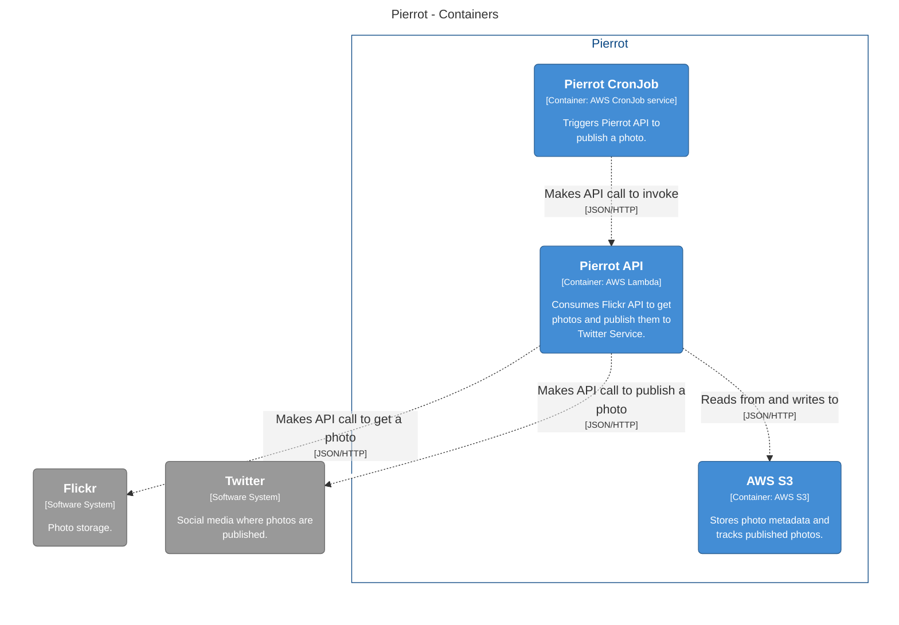
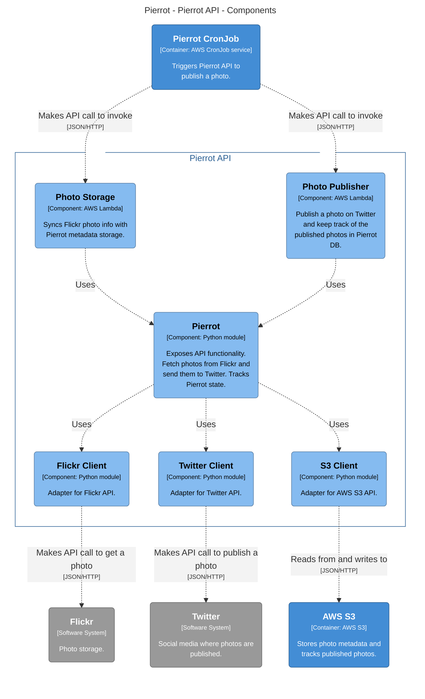

# pierrot
Photostream delivery

## Research
* Check Flickr API to list photos/files and possible filtering.

## Design
### C4 Model
#### 1. System Context

```mermaid
graph LR
  linkStyle default fill:#ffffff

  subgraph diagram ["Pierrot - System Context"]
    style diagram fill:#ffffff,stroke:#ffffff

    1("<div style='font-weight: bold'>Flickr</div><div style='font-size: 70%; margin-top: 0px'>[Software System]</div><div style='font-size: 80%; margin-top:10px'>Photo storage.</div>")
    style 1 fill:#999999,stroke:#6b6b6b,color:#ffffff
    2("<div style='font-weight: bold'>Twitter</div><div style='font-size: 70%; margin-top: 0px'>[Software System]</div><div style='font-size: 80%; margin-top:10px'>Social media where photos are<br />published.</div>")
    style 2 fill:#999999,stroke:#6b6b6b,color:#ffffff
    3("<div style='font-weight: bold'>Pierrot</div><div style='font-size: 70%; margin-top: 0px'>[Software System]</div><div style='font-size: 80%; margin-top:10px'>Publish a random photo from<br />Flickr to Twitter and keeps<br />track of what was published<br />to do not repeat photos.</div>")
    style 3 fill:#1168bd,stroke:#0b4884,color:#ffffff

    3-. "<div>Makes API call to get a photo</div><div style='font-size: 70%'>[JSON/HTTP]</div>" .->1
    3-. "<div>Makes API call to publish a<br />photo</div><div style='font-size: 70%'>[JSON/HTTP]</div>" .->2
  end
```

#### 2. Container

```mermaid
graph LR
  linkStyle default fill:#ffffff

  subgraph diagram ["Pierrot - Containers"]
    style diagram fill:#ffffff,stroke:#ffffff

    1("<div style='font-weight: bold'>Flickr</div><div style='font-size: 70%; margin-top: 0px'>[Software System]</div><div style='font-size: 80%; margin-top:10px'>Photo storage.</div>")
    style 1 fill:#999999,stroke:#6b6b6b,color:#ffffff
    2("<div style='font-weight: bold'>Twitter</div><div style='font-size: 70%; margin-top: 0px'>[Software System]</div><div style='font-size: 80%; margin-top:10px'>Social media where photos are<br />published.</div>")
    style 2 fill:#999999,stroke:#6b6b6b,color:#ffffff

    subgraph 3 [Pierrot]
      style 3 fill:#ffffff,stroke:#0b4884,color:#0b4884

      4("<div style='font-weight: bold'>Pierrot CronJob</div><div style='font-size: 70%; margin-top: 0px'>[Container: AWS CronJob service]</div><div style='font-size: 80%; margin-top:10px'>Triggers Pierrot API to<br />publish a photo.</div>")
      style 4 fill:#438dd5,stroke:#2e6295,color:#ffffff
      5("<div style='font-weight: bold'>AWS S3</div><div style='font-size: 70%; margin-top: 0px'>[Container: AWS S3]</div><div style='font-size: 80%; margin-top:10px'>Stores photo metadata and<br />tracks published photos.</div>")
      style 5 fill:#438dd5,stroke:#2e6295,color:#ffffff
      6("<div style='font-weight: bold'>Pierrot API</div><div style='font-size: 70%; margin-top: 0px'>[Container: AWS Lambda]</div><div style='font-size: 80%; margin-top:10px'>Consumes Flickr API to get<br />photos and publish them to<br />Twitter Service.</div>")
      style 6 fill:#438dd5,stroke:#2e6295,color:#ffffff
    end

    4-. "<div>Makes API call to invoke</div><div style='font-size: 70%'>[JSON/HTTP]</div>" .->6
    6-. "<div>Reads from and writes to</div><div style='font-size: 70%'>[JSON/HTTP]</div>" .->5
    6-. "<div>Makes API call to get a photo</div><div style='font-size: 70%'>[JSON/HTTP]</div>" .->1
    6-. "<div>Makes API call to publish a<br />photo</div><div style='font-size: 70%'>[JSON/HTTP]</div>" .->2
  end
```

#### 3. Component

```mermaid
graph LR
  linkStyle default fill:#ffffff

  subgraph diagram ["Pierrot - Pierrot API - Components"]
    style diagram fill:#ffffff,stroke:#ffffff

    1("<div style='font-weight: bold'>Flickr</div><div style='font-size: 70%; margin-top: 0px'>[Software System]</div><div style='font-size: 80%; margin-top:10px'>Photo storage.</div>")
    style 1 fill:#999999,stroke:#6b6b6b,color:#ffffff
    2("<div style='font-weight: bold'>Twitter</div><div style='font-size: 70%; margin-top: 0px'>[Software System]</div><div style='font-size: 80%; margin-top:10px'>Social media where photos are<br />published.</div>")
    style 2 fill:#999999,stroke:#6b6b6b,color:#ffffff
    4("<div style='font-weight: bold'>Pierrot CronJob</div><div style='font-size: 70%; margin-top: 0px'>[Container: AWS CronJob service]</div><div style='font-size: 80%; margin-top:10px'>Triggers Pierrot API to<br />publish a photo.</div>")
    style 4 fill:#438dd5,stroke:#2e6295,color:#ffffff
    5("<div style='font-weight: bold'>AWS S3</div><div style='font-size: 70%; margin-top: 0px'>[Container: AWS S3]</div><div style='font-size: 80%; margin-top:10px'>Stores photo metadata and<br />tracks published photos.</div>")
    style 5 fill:#438dd5,stroke:#2e6295,color:#ffffff

    subgraph 6 [Pierrot API]
      style 6 fill:#ffffff,stroke:#2e6295,color:#2e6295

      10("<div style='font-weight: bold'>Twitter Client</div><div style='font-size: 70%; margin-top: 0px'>[Component: Python module]</div><div style='font-size: 80%; margin-top:10px'>Adapter for Twitter API.</div>")
      style 10 fill:#85bbf0,stroke:#5d82a8,color:#000000
      11("<div style='font-weight: bold'>Pierrot</div><div style='font-size: 70%; margin-top: 0px'>[Component: Python module]</div><div style='font-size: 80%; margin-top:10px'>Exposes API functionality.<br />Fetch photos from Flickr and<br />send them to Twitter. Tracks<br />Pierrot state.</div>")
      style 11 fill:#85bbf0,stroke:#5d82a8,color:#000000
      12("<div style='font-weight: bold'>Flickr Client</div><div style='font-size: 70%; margin-top: 0px'>[Component: Python module]</div><div style='font-size: 80%; margin-top:10px'>Adapter for Flickr API.</div>")
      style 12 fill:#85bbf0,stroke:#5d82a8,color:#000000
      7("<div style='font-weight: bold'>Photo Storage</div><div style='font-size: 70%; margin-top: 0px'>[Component: AWS Lambda]</div><div style='font-size: 80%; margin-top:10px'>Syncs Flickr photo info with<br />Pierrot metadata storage.</div>")
      style 7 fill:#85bbf0,stroke:#5d82a8,color:#000000
      8("<div style='font-weight: bold'>S3 Client</div><div style='font-size: 70%; margin-top: 0px'>[Component: Python module]</div><div style='font-size: 80%; margin-top:10px'>Adapter for AWS S3 API.</div>")
      style 8 fill:#85bbf0,stroke:#5d82a8,color:#000000
      9("<div style='font-weight: bold'>Photo Publisher</div><div style='font-size: 70%; margin-top: 0px'>[Component: AWS Lambda]</div><div style='font-size: 80%; margin-top:10px'>Publish a photo on Twitter<br />and keep track of the<br />published photos in Pierrot<br />DB.</div>")
      style 9 fill:#85bbf0,stroke:#5d82a8,color:#000000
    end

    4-. "<div>Makes API call to invoke</div><div style='font-size: 70%'>[JSON/HTTP]</div>" .->7
    4-. "<div>Makes API call to invoke</div><div style='font-size: 70%'>[JSON/HTTP]</div>" .->9
    8-. "<div>Reads from and writes to</div><div style='font-size: 70%'>[JSON/HTTP]</div>" .->5
    7-. "<div>Uses</div><div style='font-size: 70%'></div>" .->11
    9-. "<div>Uses</div><div style='font-size: 70%'></div>" .->11
    11-. "<div>Uses</div><div style='font-size: 70%'></div>" .->8
    11-. "<div>Uses</div><div style='font-size: 70%'></div>" .->12
    11-. "<div>Uses</div><div style='font-size: 70%'></div>" .->10
    10-. "<div>Makes API call to publish a<br />photo</div><div style='font-size: 70%'>[JSON/HTTP]</div>" .->2
    12-. "<div>Makes API call to get a photo</div><div style='font-size: 70%'>[JSON/HTTP]</div>" .->1
  end
```

