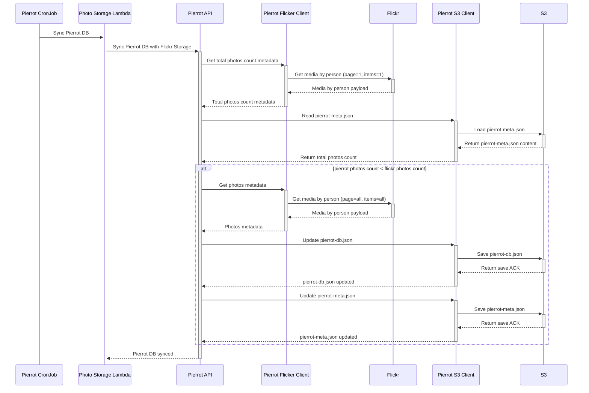
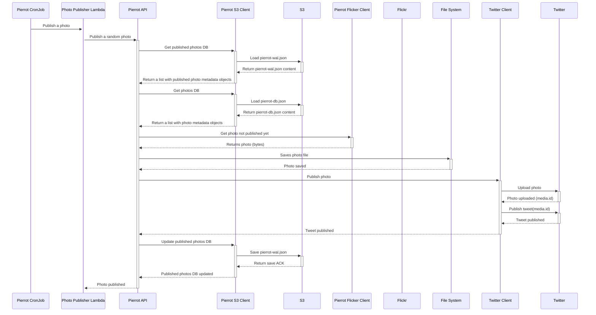

# pierrot
Photostream delivery

## Research
* Check Flickr API to list photos/files and possible filtering.

## Design (C4 Model)
### 1. System Context

### 2. Container

### 3. Component

### 4. Code
#### Pierrot DB Sync Service
This service keeps Pierrot DB on sync. Pierrot has two _databases_: 
* `pierrot-meta.json` to store the total number of photos in Pierrot DB.
* `pierrot-db.json` to store all metadata (URLs) of all photos registered by Flickr.

Updating `pierrot-db.json` is expensive, so we use `pierrot-meta.json` as a Pierrot state to verify if there are changes (more photos were added to Flickr) then we update both states `pierrot-db.json` and `pierrot-meta.json`. This service runs daily allowing the publish service to check `pierrot-db.json` to select a new photo to publish instead of check directly in Flickr (to publish a photo is required to consume Flickr to download the photo first). 

#### Pierrot Photo Publish Service
This service publish a photo on Twitter. The service runs weekly and checks `pierrot-db.json` and `pierrot-wal.json` to randomly select an unpublished photo, download it from Flickr and publish it on Twitter.

